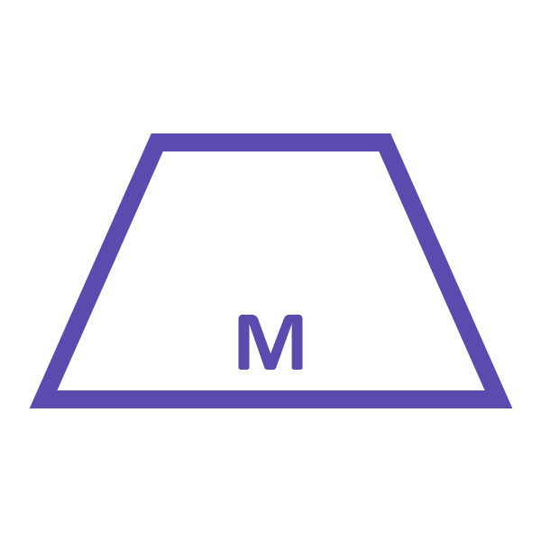

# Morphtoken
An ERC721 token that adds interoperability between collectible applications.

## Introduction

### What does interoperability mean?
Multiple different collectible games, services, trackers, and apps can use Morphtoken such that each token is a different collectible in each respective application, owned by a single user. More on why this is useful later.

### What's with the barebones website?
Morphtoken is as simple as possible, so is the documentation and website.

***

## Whitepaper
Coming April 1st.
***
# Examples

What if every professional athlete played in every sports league? If you owned the baseball card for pitcher Joe Schmoe you could also use it as the basketball card for point-guard Joe Schmoe.  That's what we're going for here.

## Simple specific individual use case  

A Morphtoken has a unique ID, for example **123123123**.  

An app could use this coin to to represent a soldier in a strategy game.  The soldiers strength could be represented as the first 4 digits of the ID divided by 9, and its defense represented by rest of the ID divided by 10.  Using modulus will work better here than division but for simplicity we chose division.

Now the owner of that Morphtoken has a unique solder in that app with **136** strength and **2312** health in that application.

## Interoperability use example

**App A** : Every token is represented by a shape. Even number IDs are squares. Odd number IDs are triangles, unless the ID ends in 999, in which case the token represents a circle. Circles are rare.

**App B** : Every token is a color represented by the last 6 digits of the ID.  

If a user owns the Morphtoken with ID **888123888** they own it in both apps A and B.  In app A it is a common (1/2 chance) square. In app B the Morphtoken is represented by a random color.

If a user owns the Morphtoken with ID **999123999** they own it in both apps A and B.  In app A it is a rare (1/1000 chance) circle, where as in App B is it a regular random color with the same probability as any other.

Trading be colors in App B becomes especially interesting when there is a chance that the color is a rare shape in App A.

***

## Contact
Creator:  
[twitter](https://twitter.com/cupojoseph)  
[email](mailto:jschiarizzi@gmail.com)

Let us know if you have questions or have used Morphtoken in your application.
